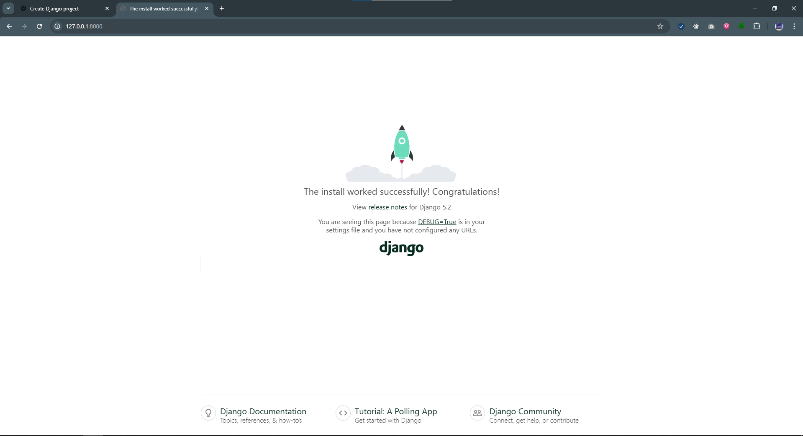

## Step 1: Install Django

### Create virtual environment
```python -m venv venv```

### Activate virtual environment
### Windows:
```venv\Scripts\activate```
### Mac/Linux:
```source venv/bin/activate```

### Install Django
```pip install django```

## Step 2: Create Django Project
```django-admin startproject myproject```
```python -m django startproject myproject .```

#### Django Project Structure

    myproject/
    ├── manage.py
    ├── myproject/
    │   ├── __init__.py
    │   ├── settings.py
    │   ├── urls.py
    │   ├── asgi.py
    │   └── wsgi.py
    └── myapp/
        ├── migrations/
        │   └── __init__.py
        ├── __init__.py
        ├── admin.py
        ├── apps.py
        ├── models.py
        ├── tests.py
        └── views.py

### Step 3: Run Development Server
```cd myproject```
```python manage.py runserver```


### Step 4: Create an App
```python manage.py startapp myapp```

### Step 5: Register App
- Open myproject/settings.py and add 'myapp' inside INSTALLED_APPS:
  ```
  INSTALLED_APPS = [
    'django.contrib.admin',
    'django.contrib.auth',
    'django.contrib.contenttypes',
    'django.contrib.sessions',
    'django.contrib.messages',
    'django.contrib.staticfiles',
    'myapp',   # ✅ add this
  ]
  ```

### Step 6: Add a View
- Open myapp/views.py and add:
  ```
  from django.http import HttpResponse

  def home(request):
    return HttpResponse("Hello, Django! 🚀")
  ```

### Step 7: Map URL
- Open myproject/urls.py and update:
  ```
  from django.contrib import admin
  from django.urls import path
  from myapp import views   # ✅ import views

  urlpatterns = [
    path('admin/', admin.site.urls),
    path('', views.home),  # ✅ default route
  ]
  ```

### Step 8: Run Again
- Start server:
  ```
  python manage.py runserver
  ```

### Setting up envi to receive data from UI with CSRF:
- Backend should be run on https to handle cookies:
  - Have to create local certificates:
    - ```Set-ExecutionPolicy Bypass -Scope Process -Force; [System.Net.ServicePointManager]::SecurityProtocol = [System.Net.ServicePointManager]::SecurityProtocol -bor 3072; iex ((New-Object System.Net.WebClient).DownloadString('https://community.chocolatey.org/install.ps1'))```
    - ```Set-ExecutionPolicy RemoteSigned -Scope CurrentUser```
    - ```irm get.scoop.sh | iex```
    - ```scoop bucket add extras```
    - ```scoop install mkcert```
    - ```mkcert -install```
    - ```mkcert localhost 127.0.0.1```
  - ```pip install django-extensions```
  - In Settings.py, add
    - ```
        # settings.py
        INSTALLED_APPS = [
            # ...
            'django_extensions',
            'corsheaders',
        ]

        # Add these lines to enable SSL for the development server
        # You can leave CSRF_COOKIE_SECURE = True and SameSite = "None"
        # as Werkzeug will handle the HTTPS setup.
      ```
    - ```pip install Werkzeug```
    - ```pip install pyOpenSSL```
    - ```python manage.py migrate```
    - ```python manage.py runserver_plus --cert-file localhost.pem --key-file localhost-key.pem```
    - ```python manage.py runserver_plus```
  - In # myapp/views.py
    ```
    from django.http import JsonResponse
    from django.views.decorators.csrf import ensure_csrf_cookie
    from django.middleware.csrf import get_token

    @ensure_csrf_cookie
    def get_csrf_token(request):
        token = get_token(request)
        return JsonResponse({"csrfToken": token})
    ```
- UI:
  ```
    import React, { useState, useEffect } from "react";

    const ValidateForm = () => {
        const [username, setUsername] = useState("");
        const [password, setPassword] = useState("");
        const [message, setMessage] = useState("");
        const [csrfToken, setCsrfToken] = useState(""); // Add csrfToken state
        const [isLoading, setIsLoading] = useState(true);

        useEffect(() => {
            const fetchCsrfToken = async () => {
                try {
                    // Fetch the token directly from the response body
                    const response = await fetch("https://127.0.0.1:8000/csrf/", {
                        credentials: "include",
                    });
                    const data = await response.json();
                    setCsrfToken(data.csrfToken); // Use the token from the JSON
                } catch (error) {
                    console.error("Failed to fetch CSRF token:", error);
                } finally {
                    setIsLoading(false);
                }
            };
            fetchCsrfToken();
        }, []);

        const handleSubmit = async (e) => {
            e.preventDefault();

            console.log("csrfToken being sent: ", csrfToken);

            const res = await fetch("https://127.0.0.1:8000/validate/", {
                method: "POST",
                headers: {
                    "Content-Type": "application/json",
                    "X-CSRFToken": csrfToken, // Use state token
                },
                credentials: "include",
                body: JSON.stringify({ username, password }),
            });

            if (res.ok) {
                const data = await res.json();
                setMessage("✅ " + JSON.stringify(data));
            } else {
                const errorText = await res.text();
                setMessage("❌ Error: " + errorText);
            }
        };

        if (isLoading) {
            return <div>Loading form...</div>;
        }

        return (
            <form onSubmit={handleSubmit}>
                <input
                    type="text"
                    placeholder="Username"
                    value={username}
                    onChange={(e) => setUsername(e.target.value)}
                />
                <input
                    type="password"
                    placeholder="Password"
                    value={password}
                    onChange={(e) => setPassword(e.target.value)}
                />
                <button type="submit">Submit</button>
                <p>{message}</p>
            </form>
        );
    };

    export default ValidateForm;

  ```


